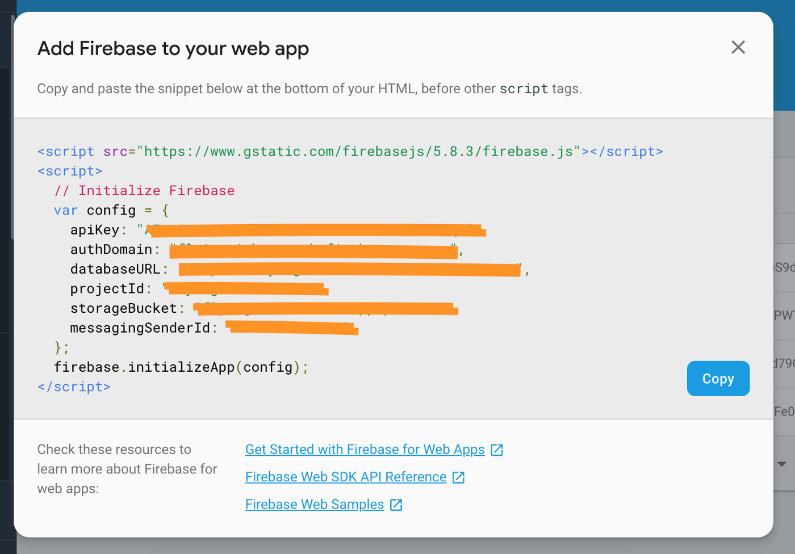

# Boilerplate for Firebase Authentication with React

Created using instructions from - https://medium.com/firebase-developers/how-to-setup-firebase-authentication-with-react-in-5-minutes-maybe-10-bb8bb53e8834

## Steps

1. Clone the repository using

```
git clone https://github.com/maxengel99/react-firebase-auth-boilerplate.git
```

2. Initialize your project and install the dependencies

```
npm init
```

3. Ensure you have a firebase account and project. Follow these steps if you do not have one. (Steps taken from another source)

### Firebase setup

a. Start <a href="https://console.firebase.google.com/u/0/">creating a Firebase project</a> if you don’t have one already.

b. Go to the Authentication page.

c. Click on the “Sign-in method” tab and make sure you have Google-enabled as a sign-in provider.


d. Scroll down a bit and also make sure you have localhost as an Authorized Domain:


e. On the top of the Authentication page, click on the “Web Setup” button. It will show up a modal just like this:



f. Create a .env file. Copy the config variable and paste it into your .env file. It should look something like this:

```
REACT_APP_FIREBASE_KEY=[insert firebase key]
REACT_APP_FIREBASE_AUTH_DOMAIN=[insert authorized domain]
REACT_APP_FIREBASE_DATABASE_URL=[insert database url]
REACT_APP_FIREBASE_STORAGE_BUCKET=[insert storage bucket]
REACT_APP_FIREBASE_MESSAGING_SENDER_ID=[insert messaging sender ID]
```

4. Your project should run now using

```
npm run start
```


